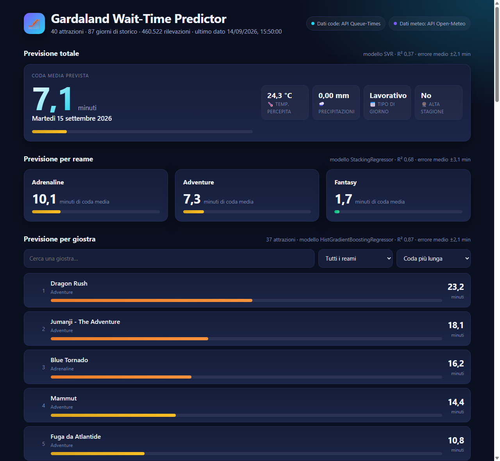

# Gardaland Wait-Time Predictor

Pipeline completa — raccolta dati, database, machine learning, API e interfaccia — che prevede
quanto si aspetterà in coda a Gardaland domani: per l'intero parco, per ogni reame e per ogni
singola giostra.



## Il problema

I tempi di attesa di un parco divertimenti sono pubblici in tempo reale, ma nessuno li conserva:
sapere che *adesso* Blue Tornado ha 40 minuti di coda non aiuta chi deve decidere **che giorno
andare**. Questo progetto archivia quel flusso effimero, lo incrocia con il meteo e con il
calendario italiano, e lo trasforma in una previsione per il giorno dopo.

## Cosa c'è dentro

| Ambito | Come è affrontato |
|---|---|
| **Data ingestion** | due client verso API pubbliche, schedulati ogni 15 minuti, con cache HTTP, retry e backoff |
| **Database** | PostgreSQL con indici univoci anti-duplicato, `ON CONFLICT DO NOTHING`, e view SQL che fanno le aggregazioni giornaliere |
| **Feature engineering** | meteo + calendario italiano: festivi, weekend, **ponti** (giorni lavorativi incastrati tra due non lavorativi) e alta stagione |
| **Machine learning** | 25 regressori scikit-learn messi in gara su tre dataset diversi, con metriche di ogni run salvate a database |
| **Serving** | FastAPI con endpoint JSON documentati, modelli caricati da disco e ricaricati solo quando cambiano |
| **Frontend** | dashboard responsive in HTML/CSS/JS puro, senza framework né build step |
| **Deploy** | Docker Compose a tre servizi, volumi persistenti per dati e modelli |

## Come funziona

```
 queue-times.com API ─┐
                      ├─► scheduler (15 min) ─► PostgreSQL ─► view di aggregazione
     Open-Meteo API ──┘                             │              giornaliera
                                                    ▼
                                         training.py: 25 modelli × 3 livelli
                                                    │
                                            models/*.joblib
                                                    │
                              predictor.py ─► FastAPI ─► dashboard
```

Le due fonti sono gratuite e senza chiave API:

- **[queue-times.com](https://queue-times.com/parks/12/queue_times.json)** — stato e minuti di attesa
  di ogni attrazione, con il reame di appartenenza
- **[Open-Meteo](https://open-meteo.com/)** — temperatura percepita e precipitazioni sulle coordinate
  del parco (45.4544, 10.7139), storiche per il training e previste per la previsione

## Le previsioni, su tre livelli

Il training costruisce tre dataset dalla stessa base e, per ciascuno, elegge il modello migliore:

| Livello | Una riga è… | Righe | Modello vincente | R² |
|---|---|---|---|---|
| **Totale parco** | un giorno | 85 | SVR | 0,366 |
| **Per reame** | (giorno, reame) | 249 | StackingRegressor | 0,685 |
| **Per giostra** | (giorno, giostra) | 2.884 | HistGradientBoostingRegressor | 0,872 |

*Valori dell'ultimo training su 87 giorni di storico.*

Le feature sono le stesse ai tre livelli — temperatura percepita, precipitazioni, tipo di giorno,
alta stagione, trend temporale — più il one-hot di reame e giostra nei livelli di dettaglio.

Il salto di qualità da 0,37 a 0,87 non è magia: al livello di dettaglio ogni riga porta con sé
*quale* attrazione è, e la differenza strutturale tra Blue Tornado e una giostra per bambini spiega
molta più varianza del meteo. Il modello del totale, con 85 righe e nessuna informazione oltre a
meteo e calendario, è il più onesto indicatore di quanto storico manchi ancora.

## Scelte tecniche, e perché

- **One-hot delle giostre invece di un modello per giostra.** Con ~80 giorni di dati, 37 modelli
  separati vedrebbero 80 righe ciascuno. Un modello unico con l'identità dell'attrazione come
  feature ne vede 2.884 e permette alle giostre con poco storico di ereditare il comportamento del
  loro reame.
- **Il modello salvato porta con sé le sue feature.** Ogni `.joblib` è un bundle con pipeline,
  elenco ordinato delle colonne e metadati: al momento della previsione le righe vengono costruite
  su quell'elenco, così un training con nuove giostre non può disallineare silenziosamente
  training e serving.
- **Aggregazioni come view SQL, non in pandas.** Le medie giornaliere sono definite una volta sola
  nello schema e restano identiche per training, API e query manuali.
- **Sopra le 1.000 righe i modelli quadratici vengono saltati.** SVR, MLP e TheilSen sul dataset per
  giostra allungavano il training di decine di minuti senza vincere mai.
- **Ingestion che si autocensura.** Se tutte le attrazioni risultano chiuse il parco è chiuso: quei
  dati non vengono salvati, altrimenti mesi di zeri falserebbero le medie.
- **Nessun framework nel frontend.** La dashboard è un file HTML servito statico: nessuna toolchain
  da mantenere, e le API restano il vero prodotto.

## Provalo

Il repo include **87 giorni di storico reale** (`seed/demo_data.sql.gz`: 460.522 rilevazioni delle
giostre e 280 del meteo), caricato in automatico alla prima creazione del database. Non serve
aspettare settimane di raccolta per vedere il progetto funzionare.

```bash
cp .env.example .env              # e personalizza le credenziali
docker compose up -d --build      # il seed viene caricato qui
docker exec gardaland-api python training.py
```

Il training dura un paio di minuti e allena tutti e tre i livelli. Poi la dashboard è su
[localhost:8000](http://localhost:8000), con gli stessi numeri dello screenshot qui sopra.

I tre servizi sono **db** (PostgreSQL 16, esposto su `localhost:5433`), **worker** (ingestion ogni 15
minuti, che continua ad accumulare storico) e **api**. I modelli finiscono nel volume condiviso
`gardaland_models`: la dashboard li ricarica da sola al training successivo, senza riavvii.

Il seed si carica solo su un volume vuoto, quindi un database già popolato non viene mai toccato.
Per ripartire da capo: `docker compose down -v` (attenzione, cancella i dati raccolti).

### API

| Endpoint | Risposta |
|---|---|
| `GET /api/previsione` | previsione di domani ai tre livelli, con meteo e metriche del modello usato |
| `GET /api/storico?giorni=N` | serie giornaliera di coda media e meteo osservato |
| `GET /api/storico/giostre?giorni=N` | media e massimo per giostra negli ultimi N giorni |
| `GET /api/modelli` | ultimo confronto tra modelli per ciascun livello |
| `GET /api/stato` | conteggi del database, modelli disponibili, fonti dei dati |
| `GET /health` | stato del servizio |

Documentazione interattiva generata da FastAPI su [/docs](http://localhost:8000/docs).

### Sviluppo in locale

```bash
python -m venv .venv
.venv\Scripts\Activate.ps1      # PowerShell
pip install -r requirements.txt

python main.py                  # una singola ingestion
python training.py              # allena i tre livelli
uvicorn api.main:app --reload   # dashboard su http://127.0.0.1:8000
```

Con `POSTGRES_HOST=127.0.0.1` e `POSTGRES_PORT=5433` gli script locali parlano con il Postgres del
compose: database in Docker, resto fuori.

## Struttura

```
main.py                  una passata di ingestion (code + meteo)
scheduler.py             APScheduler: main() ogni 15 minuti
working_day.py           tipo di giorno (festivo/weekend/ponte) e alta stagione
training.py              dataset, confronto dei 25 modelli, salvataggio dei tre livelli
predictor.py             carica i modelli e calcola le previsioni
ingestion/
  queue_times_client.py  client API queue-times.com
  meteo_client.py        client API Open-Meteo (osservato + previsione di domani)
  crud.py                engine SQLAlchemy e query
api/
  main.py                FastAPI: endpoint JSON
  static/index.html      dashboard
db/schema.sql            tabelle, indici e view
seed/demo_data.sql.gz    87 giorni di storico reale, caricato al primo avvio
docs/                    immagini per questo README
```

### Database

Tabelle: `giostre` (una riga per attrazione per rilevazione), `meteo`, `previsioni`, `model_runs`
(log dei training, una riga per livello, con tutte le metriche in JSONB).

View: `coda_giornaliera` (media per giostra e giorno, solo attrazioni aperte), `temp_giornaliera`,
`totale_giornaliero` (meteo + coda media del giorno, **limitata ai reami Adrenaline e Adventure**).

Quel filtro è il motivo per cui la previsione totale non coincide con la media dei reami: il totale
pesa solo le attrazioni principali, mentre i livelli reame e giostra coprono tutto il parco.

## Limiti noti e prossimi passi

- **Storico corto.** 87 giorni concentrati su un'estate: il modello del totale ne risente. Ogni
  stagione raccolta lo migliora senza toccare una riga di codice.
- **Retraining manuale.** Il worker fa solo ingestion; il training si lancia a mano. Passo naturale:
  un job schedulato settimanale che riallena e tiene il modello solo se batte il precedente.
- **Nessun test automatico né CI.** La priorità è stata far girare la pipeline end-to-end.
- **Granularità oraria.** Oggi la previsione è una media giornaliera; i dati grezzi sono a 15 minuti
  e permetterebbero di prevedere anche *a che ora* andare.

### Problema noto con Docker

`failed to execute bake: read |0: file already closed` durante `docker compose up --build` è un bug
di Docker Desktop quando compose delega la build a buildx bake: le immagini vengono costruite ma i
container non ricreati. Si aggira disattivando bake:

```powershell
$env:COMPOSE_BAKE="false"; docker compose up -d --build
```
